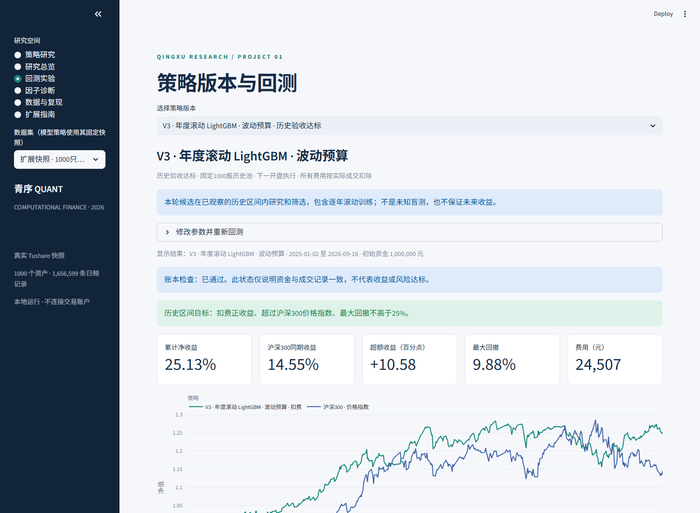

# 青序 · CF2026量化研究平台

当前研究版本 **V3：年度滚动LightGBM＋波动预算**。平台发布版本v2.1.0。

2025-01-02至2026-09-18，扣费累计收益 **25.13%**、年化 **14.51%**、最大回撤 **9.88%**。同期沪深300价格指数14.55%、全收益指数19.94%，分别超过10.58和5.19个百分点。双倍费用仍收益22.48%；2023起连续运行收益44.09%、最大回撤19.70%。

**选择边界：本轮验证期预选价值主题随后失败；当前LightGBM是在查看固定历史复核结果后选出的候选，不属于独立盲测成功。2024年曾落后指数，不保证未来收益。** 8个候选、失败预选、V2原结果和V1动量失败均保留。



## 打开与切换策略

本机双击 `launch.cmd`，打开 http://127.0.0.1:8501 。

- 策略研究：默认最新V3，可切回V2研究。
- 回测实验：选择策略版本，包含8个V3候选、5个V2模型与V1单因子自由实验。默认最新历史验收合格版本。
- 展开“修改参数并重新回测”可调整日期、持仓、调仓频率、费用、资金。模型回测固定其1000股历史快照，2023起有可用分数。
- 切换版本清除旧结果。账本正确与收益/风险目标分开显示，亏损或回撤超门槛不再显示为策略合格。

新电脑安装Python3.12/3.13：

```powershell
py -3.12 -m venv .venv
.venv/Scripts/python.exe -m pip install -r requirements-research-lock.txt
.venv/Scripts/python.exe -m pip install -e ".[dev,research]"
.venv/Scripts/python.exe -m pytest -q
.venv/Scripts/python.exe -m cfquant.cli run --config configs/demo.yaml
.venv/Scripts/python.exe -m streamlit run app.py
```

无需Token可看公开聚合结果和版本日账本，运行合成样本。真实模型重跑需要本地原始快照、特征及模型分数；缺失时不会冒充已重算。

## 最新提交材料

- [10页V3报告](reports/benchmark_v3/CF2026_V3_Final_Report.pdf)与[LaTeX源码](reports/benchmark_v3/final_report.tex)
- [20页Beamer PDF](reports/benchmark_v3/CF2026_V3_Beamer.pdf)、[Beamer源码](reports/benchmark_v3/beamer.tex)、[可编辑PowerPoint](reports/benchmark_v3/CF2026_V3_Presentation.pptx)
- [约19分钟讲稿](docs/PRESENTATION_SCRIPT_V3.md)，18页正文、2页答辩备份
- [V3复现与验收](docs/REPRODUCE_V3.md)、[事前协议](docs/RESEARCH_PROTOCOL_V3.md)、[基准官方来源](docs/BENCHMARK_METHOD_SOURCES_V3.md)、[完整证据](evidence/research_v3)
- [12因子卡](docs/FACTOR_CARDS_V2.md)、[原课程逐项验收](docs/ACCEPTANCE_V2.md)、[V2历史说明](docs/README_V2_ARCHIVE.md)、[V1历史说明](docs/README_V1_ARCHIVE.md)

## 模型与数据

2019年末固定1000只主板股票，价格2019-10-08至2026-09-18，共1,656,599条记录、1690个交易日。估值、公告财务和历史行业形成12个因子；LightGBM输入标准化及中性化两套表示，共24列，每年使用此前3年的已实现20日标签重训。250树、15叶、最大深度5，参数不按最终区间扫描。

50股、20日调仓、20名持仓缓冲，逆波动、单股4%、行业25%目标，20%波动预算，最高95%股票仓位，指数低于120日均线时预算乘0.75。前20日平均成交额1%容量代理、部分成交和按实际成交收费。风险目标会漂移，不保证未来回撤上限。

官方目录确认H00300.CSI为沪深300全收益指数；价格指数000300.SH、全收益指数、ETF510330.SH代理均分别比较。研究用连续复权单位，未完整模拟整手、结算、分红现金、历史税费和盘口；固定池和厂商数据修订限制泛化。

52项测试、21个V3研究账本、独立环境四张表复算、完整浏览器版本切换及重跑检查。继承并禁用已复现故障的NumExpr可选路径，详情见[数值审计](docs/NUMERICAL_AUDIT.md)。

真实行情、财报、Token、虚拟环境、逐股模型分数保留本地，不进入公开Git。参考Qlib设计、复用LightGBM/sklearn，不声称完整实现Alpha158或Qlib引擎。版本历史保留v2.0.0；未附加项目开源许可证，第三方依赖保留各自许可。
