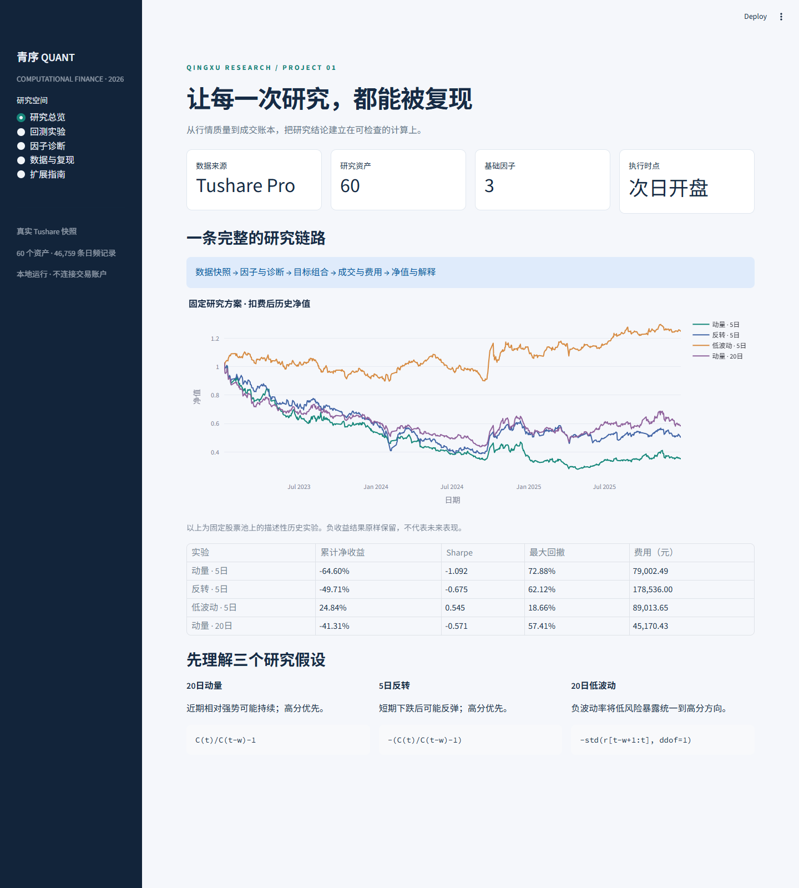

# CF2026 量化研究平台

计算金融 Project 1：从真实日频行情到因子诊断、组合回测和可复现实验。

验收版本。Python计算包、中文交互界面和命令行共享同一核心。真实研究使用用户自己的Tushare权限；凭据和原始行情不进入Git。仓库附带可分享合成样本，新电脑无Token也能演示。

## 快速开始

本机：双击launch.cmd，打开 http://127.0.0.1:8501 。新电脑先安装Python3.12/3.13，再执行：

~~~powershell
py -3.12 -m venv .venv
.\.venv\Scripts\python.exe -m pip install -r requirements-lock.txt
.\.venv\Scripts\python.exe -m pip install -e ".[dev]"
.\.venv\Scripts\python.exe -m pytest -q
.\.venv\Scripts\python.exe -m cfquant.cli run --config configs/demo.yaml
.\.venv\Scripts\python.exe -m streamlit run app.py
~~~

真实数据和完整实验：

~~~powershell
.\.venv\Scripts\python.exe -m cfquant.cli download --token-file D:\Desktop\tushare_token.txt
.\.venv\Scripts\python.exe -m cfquant.cli study
~~~

原始缓存、标准行情、研究结果分别保存在data/raw、data/processed、runs。改变源码、数据或参数会产生新实验签名，研究索引明确指定报告所用版本。

## 交付内容

- [使用与验收指南](docs/USER_GUIDE.md)：安装、运行、界面和演示顺序。
- [架构与扩展](docs/ARCHITECTURE.md)：模块职责、插件和后续项目接口。
- [数据与计算口径](docs/CONVENTIONS.md)：字段、因子、成交、缺失和指标。
- [固定对照方案](docs/EXPERIMENT_PLAN.md)：事前问题和控制变量。
- [研究报告](reports/CF2026_Project1_Report.pdf)与[LaTeX源码](reports/report.tex)：8页真实研究。
- evidence：测试、汇总结果、源数据校验清单和UI截图；tests：独立计算与集成检查。

## 真实实验概览

2023–2025年，60只样本，727个交易日。固定因子方向及成本，保留亏损结果：

| 策略 | 累计净收益 | 最大回撤 |
|---|---:|---:|
| 动量 / 每5交易日调仓 | -64.60% | 72.88% |
| 反转 / 每5交易日调仓 | -49.71% | 62.12% |
| 低波动 / 每5交易日调仓 | +24.84% | 18.66% |
| 动量 / 每20交易日调仓 | -41.31% | 57.41% |

这是固定样本上的描述性历史比较，不是预测收益或全市场结论。降低动量调仓频率减少了换手和成本，但没有使其盈利；正IC也没有使反转策略获得正净收益。

## 设计边界

- 研究级日频模拟，使用一致复权价格和连续可分的总收益单位；不声称是实盘执行系统。
- 当日收盘生成信号，下一个交易日开盘执行。
- 三个基准因子：20 日动量、5 日反转、20 日低波动。
- 成交成本按实际买卖金额计提；缺失开盘价格和涨跌停会阻止相应成交。
- 数据、因子、目标组合、成交账本、诊断、实验和界面职责独立。
- 不以盈利与否判断软件正确性；不隐去不支持研究假设的结果。

新增因子可通过注册表进入相同的诊断和回测，无需改动成交核心。自动测试覆盖手算公式、下一开盘时点、费用、涨跌停、缺失估值、拆股连续性、故意泄漏插件、独立Backtrader对照与UI提交。

## 报告重建

安装XeLaTeX后，完成真实数据study，再运行python scripts/build_report.py。脚本生成图和report.tex，编译为PDF。当前报告模板针对默认课程研究方案；更换研究股票池或日期后，应同步修订研究描述。

GitHub仓库保持私有；不附加未经确认的对外开源许可。第三方依赖保留各自许可证，Backtrader仅作为开发验证依赖使用。
