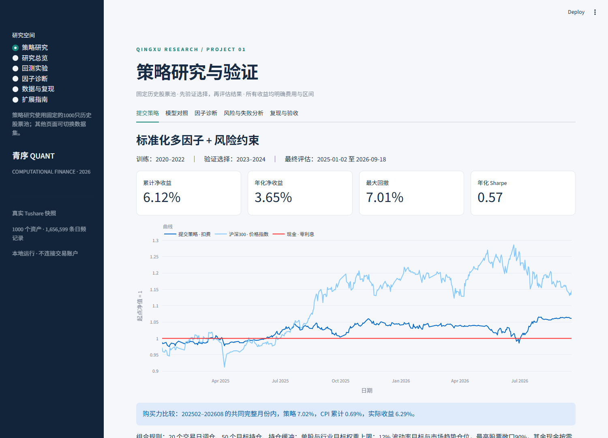

# 青序 · CF2026量化研究平台

计算金融Project 1最终版：可复现的真实数据研究、12因子、模型比较、含费用成交账本及中文交互平台。

**提交策略：验证期选出的标准化多因子＋风险约束。** 2025-01-02至2026-09-18累计净收益6.12%，年化3.65%，最大回撤7.01%。共同完整月份内跑赢CPI，收益仍低于同期沪深300价格指数；这段历史不保证未来收益。LightGBM最终期更强，但没有据此替换验证期预选策略。



## 先运行，再看材料

本机双击`launch.cmd`，浏览器打开 http://127.0.0.1:8501 。新电脑用Python3.12/3.13：

```powershell
py -3.12 -m venv .venv
.venv/Scripts/python.exe -m pip install -r requirements-research-lock.txt
.venv/Scripts/python.exe -m pip install -e ".[dev,research]"
.venv/Scripts/python.exe -m pytest -q
.venv/Scripts/python.exe -m cfquant.cli run --config configs/demo.yaml
.venv/Scripts/python.exe -m streamlit run app.py
```

无Token可以查看已发布真实研究证据、运行合成样本并演示完整界面。原始Tushare数据与凭据仅在本地，重新下载需自己的权限。新旧股票池及样本身份明确分开。

## 最终交付

- [10页最终报告](reports/final/CF2026_Final_Report.pdf)及[LaTeX源码](reports/final/final_report.tex)。
- [20页Beamer演示PDF](reports/final/CF2026_Beamer.pdf)、[Beamer源码](reports/final/beamer.tex)和[可编辑PowerPoint](reports/final/CF2026_Presentation_Final.pptx)。
- [约20分钟讲稿与演示步骤](docs/PRESENTATION_SCRIPT.md)。正文18页，2页答辩备份。
- [完整复现指南](docs/REPRODUCE_V2.md)、[课程逐项验收](docs/ACCEPTANCE_V2.md)、[12因子卡](docs/FACTOR_CARDS_V2.md)。
- [事前实验协议](docs/RESEARCH_PROTOCOL_V2.md)、[数值重复性修复说明](docs/NUMERICAL_AUDIT.md)、[派生证据](evidence/research_v2)。
- 原始60股项目与失败案例仍保留在[历史说明](docs/README_V1_ARCHIVE.md)，不冒充最终报告。

## 数据与研究设计

固定2019-12-31的1,000只主板股票，行情2019-10-08至2026-09-18，共1,656,599条日线、1,690个交易日。追加同规模每日估值、57,389条财务指标和1,432个历史行业区间。行情和研究缓存约1.63GB。

训练2020–2022、验证2023–2024、最终评估2025–2026-09-18。对照包括标准化多因子、中性化多因子、Ridge、LightGBM、小型MLP。严格按公告日滞后，清除跨训练边界的未来标签。原动量全期已被观察，最终区间不称完全未知的盲测。

| 最终期候选 | 年化净收益 | 最大回撤 | 选择依据 |
|---|---:|---:|---|
| 标准化多因子 | 3.65% | 7.01% | 验证期预选 |
| 中性化多因子 | 5.36% | 10.26% | 保留对照 |
| Ridge | 7.12% | 10.66% | 保留对照 |
| LightGBM | 13.09% | 11.69% | 保留对照 |
| 小型MLP | 5.76% | 10.31% | 保留对照 |

## 平台能力与边界

数据、因子/模型、目标组合、成交账本、统计及界面相互独立。组合可持现金；支持持仓缓冲、单股/行业目标上限、波动预算、趋势仓位、事前流动性预算与部分成交。增量合并输出新的标准行情及修订审计，测试覆盖分段等于全量和重复幂等。

本机发现可选NumExpr加速在大面板除法中偶发错误，已统一禁用并加入实际失败复现的回归测试。重新生成全部研究，独立环境复算结果见repeatability.json。

研究用连续可分的复权单位，未实现完整整手、分红现金、税费历史、结算和盘口；固定历史池、厂商财报修订、行业重构和长期缺失估值仍限制外推。风险权重是形成时目标，实际权重会漂移。原始动量累计−83.57%、零费用重跑−75.16%均保留。

参考Qlib工作流与因子表达，复用sklearn/LightGBM；未声称完整复制Alpha158或集成Qlib成交引擎。参考CogAlpha的代码式因子表示，未运行LLM演化挖掘。

## Git与许可证

公开仓库只包含代码、合成样本、报告和派生汇总，真实行情、财报、Token及虚拟环境不进入Git。提交历史保留原始平台、数据扩展、研究协议、模型与风险模块、数值修复及最终材料。当前未附加项目开源许可证；公开可见不等于授予任意再分发许可，第三方依赖保留各自许可证。
