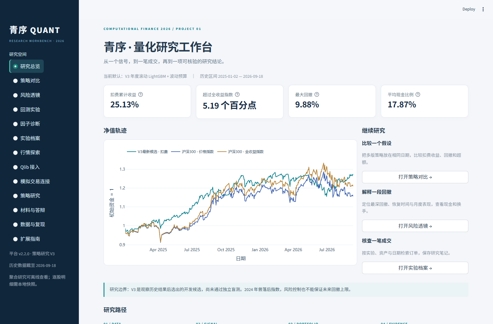

# 青序 · 量化研究工作台

**平台 v2.2.2 / 增强版 V4，策略研究保留 V3。** 本地运行的 Python 研究平台：从行情、因子和策略，到成交核对、风险解释与实验记录。

v2.2.1新增醒目的年化夏普比率、可调无风险利率与60日滚动夏普。默认0%假设下V3为1.255，同期沪深300全收益指数为0.736；[公式、复算和答辩说明](docs/SHARPE_RATIO.md)。V4报告已包含默认值，PDF保留v2.2.0发布时的验收记录。

v2.2.2在“回测实验”补齐V2/V3的年化夏普结果卡，V1也统一中文标签；显示当前结果实际使用的无风险利率与年化参数。



## 这一版可以做什么

| 页面 | 可以实际完成的操作 |
| --- | --- |
| 研究总览 | 查看最新研究结果与边界，直接进入比较、风险、实验和材料 |
| 策略对比 | 同时选择最多5个V2/V3版本，选择日期和价格/全收益基准，下载完整分析包 |
| 风险透镜 | 月收益、回撤事件与恢复、60日滚动风险、现金/换手/费用，静态现金比例与通胀假设情景 |
| 回测实验 | 切换V1/V2/V3，修改参数重跑；资金账本与策略收益验收分别判断 |
| 因子诊断 | 12个研究因子统一入口，日期筛选、IC/Rank IC、分组与覆盖；保留原三因子自由诊断 |
| 实验档案 | 搜索本地实验，检索持仓与订单、解释未成交、下载结果、保存本地笔记 |
| 行情探索 | 股票搜索、复权/原始K线、均线、成交量、缺失交易日与CSV导出 |
| Qlib 接入 | 正式pyqlib表达式引擎、8个表达式独立核对、官方Alpha158浏览与诊断、隔离进程重跑 |
| 模拟交易连接 | 同花顺/SuperMind成交CSV字段适配、金额校验、重复提示、本地回执；历史观察权重导出 |
| 材料与答辩 | 报告、Beamer、可编辑PPTX、完整逐页讲稿与演示操作卡 |

**Qlib是真实接入，当前范围是数据与因子研究桥。** pyqlib 0.9.7在独立环境调用；20股、33,754条行情、1,690个交易日，8项表达式逐项核对，官方Alpha158的158项均产生有效输出。没有以此重新训练或替换V3投资策略。[接入说明](docs/QLIB_INTEGRATION.md)

**同花顺当前是文件桥，外部账号/API尚未连接。** 可导入官方成交明细字段，校验后保存回执；没有登录或提交订单。历史复权单位不当作委托股数，成交现金流不冒充账户收益。[连接状态与后续步骤](docs/THS_CONNECTION.md)

## 打开平台

本机双击 `launch.cmd`，打开 http://127.0.0.1:8501 。新电脑安装Python3.12/3.13：

```powershell
py -3.12 -m venv .venv
.venv/Scripts/python.exe -m pip install -r requirements-research-lock.txt
.venv/Scripts/python.exe -m pip install -e ".[dev,research]"
.venv/Scripts/python.exe -m pytest -q -p no:cacheprovider
.venv/Scripts/python.exe -m cfquant.cli run --config configs/demo.yaml
.venv/Scripts/python.exe -m streamlit run app.py
```

无Token可看真实公开聚合结果、12因子诊断、Qlib核验结果，运行合成样本与模拟成交文件校验。真实模型重跑、行情与逐股成交需要本地私有快照。Qlib重跑另需独立环境；不修改已验证的主环境依赖。

日期筛选是原有持仓路径的切片，包含所选首日收益；“回测实验”才是在指定日期重新启动。现金比例工具是静态分配的算术情景，不再平衡，也不重新模拟资金规模对费用和容量的影响。

## 最新提交材料

- [10页报告](reports/platform_v4/CF2026_V4_Final_Report.pdf)与[源码](reports/platform_v4/final_report.tex)
- [20页LaTeX Beamer](reports/platform_v4/CF2026_V4_Beamer.pdf)、[可编辑PowerPoint](reports/platform_v4/CF2026_V4_Presentation.pptx)
- [可打印逐页讲稿](reports/platform_v4/CF2026_V4_Speaker_Script.pdf)与[可编辑讲稿](docs/PRESENTATION_SCRIPT_V4.md)，18页正文约19分钟＋2页备份
- [课程逐项验收](docs/ACCEPTANCE_V4.md)、[复现步骤](docs/REPRODUCE_V4.md)、[本轮验证证据](evidence/platform_v4)
- [V3历史材料](docs/README_V3_ARCHIVE.md)、[12因子卡](docs/FACTOR_CARDS_V2.md)、[基准来源](docs/BENCHMARK_METHOD_SOURCES_V3.md)

## 保留的V3策略与边界

2025-01-02至2026-09-18：扣费累计收益25.13%、年化14.51%、最大回撤9.88%；同期沪深300价格指数14.55%、全收益指数19.94%。双倍费用收益22.48%；2023起连续运行44.09%、最大回撤19.70%。

**当前候选是在查看历史复核后选出的开发候选，尚非独立盲测成功。** 2024年曾落后指数。完整8个V3候选、失败预选、5个V2模型和V1失败结果均保留；本轮工具增强没有重新挑选历史赢家，也不保证未来收益。

原始快照固定2019年末1000只主板股票，价格2019-10-08至2026-09-18，共1,656,599条记录。12个经济因子的标准化及中性化表示构成24输入；模型每年使用此前3年已实现标签重训。50股、20日调仓、20名缓冲、单股4%/行业25%目标、20%波动预算、95%最大股票仓位、指数趋势折减，允许现金，不用杠杆。

研究用连续复权单位，未完整模拟整手、结算、分红现金、历史税费和盘口；固定池与厂商数据修订限制泛化。目标权重会漂移，风险预算不能保证回撤上限。

## 验证与维护

主环境104项测试通过，1项可选Qlib引擎测试因未在主环境安装Qlib而跳过；该引擎测试在独立Qlib环境的5项专项测试中实际通过。v2.2.1增加非零无风险利率手算例及界面重算测试，证据见`evidence/sharpe_v221`；V4原始材料保留发布时102项通过的记录。保留21个V3账本检查与独立环境复算。新分析模块重算V3指标与原证据一致，测试覆盖首日损失、内部缺日、月复利、未恢复回撤、CSV编码/金额/重复、笔记与回执安全保存。

- `analytics.py`：共享诊断和分析计算；`engine.py`：成交与账本。
- `strategies.py`：策略版本与重跑；`experiment_catalog.py`：实验索引与明细读取。
- `qlib_bridge.py`：外部表达式数据适配；`simulation_bridge.py`：模拟成交文件协议。
- `ui_*.py`：界面模块；主应用负责导航，公开证据与私有原始数据分别加载。

因已复现NumExpr在原Anaconda环境的数值异常，保留禁用该可选计算路径的既有策略，详情见[数值审计](docs/NUMERICAL_AUDIT.md)。真实行情、凭据、逐股模型分数、实验笔记与模拟回执留在本地，不进入公开Git。第三方依赖保留各自许可；不声称完整实现Qlib模型或外部交易引擎。
